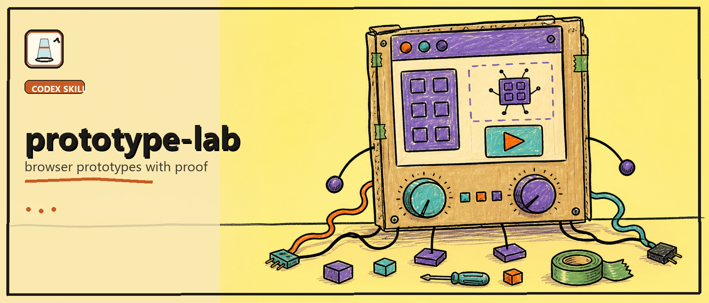

# Prototype Lab



Codex skill pack for organized, standalone browser/UI prototypes with metadata, compact interaction shells, and screenshot-backed proof.

Prototype Lab gives Codex a repeatable organization contract for prototype work: chronological folders, local runtime files, a structural full-screen shell, top-toolbar navigation and controls, a collapsible right-side panel, product-design iteration notes, and local proof before handoff. It is meant for teams that use prototypes as working evidence, not loose mockups.

## Quick Start

1. Clone or download this repository.
2. Install or copy `SKILLS/prototype-lab` into a Codex skills directory.
3. Ask Codex to use `prototype-lab` when creating or improving browser/UI prototypes.

## Usage

Example request:

```text
Use prototype-lab to create a standalone browser prototype for a prototype browser calendar view.
```

The skill directs new prototypes into this shape:

```text
prototypes/<YYYY>/<MM>/<NNN>-<prototype-slug>/
  metadata.json
  README.md
  index.html
  styles.css
  app.js
  assets/
  proof/
```

Category, model, tags, status, details, views, and proof live in `metadata.json`. Each prototype keeps its runtime local; it should not depend on shared components or sibling prototype code.

## What's Included

- [`SKILL.md`](./SKILLS/prototype-lab/SKILL.md): the full Codex structure and handoff contract.
- [`assets/prototype-shell/`](./SKILLS/prototype-lab/assets/prototype-shell): standalone shell starter files.
- [`references/quality-bar.md`](./SKILLS/prototype-lab/references/quality-bar.md): structure, behavior, viewport, and proof checklist.
- [`references/product-design-loop.md`](./SKILLS/prototype-lab/references/product-design-loop.md): product-thinking loop for prototype intent, user flows, and feedback states.
- [`references/taste-calibration.md`](./SKILLS/prototype-lab/references/taste-calibration.md): compact visual calibration, density, hierarchy, and interaction polish.

## Validate

```bash
npm run validate
```

The validator checks required files, frontmatter, JSON metadata, public-doc wording, and accidental local path references.

## Status

Preview skill pack.

- The skill, shell template, and design/proof references are included.
- No prototype browser/server tooling is required.
- The target project's `prototypes/` root should contain only year folders.

## License

[MIT](./LICENSE)
