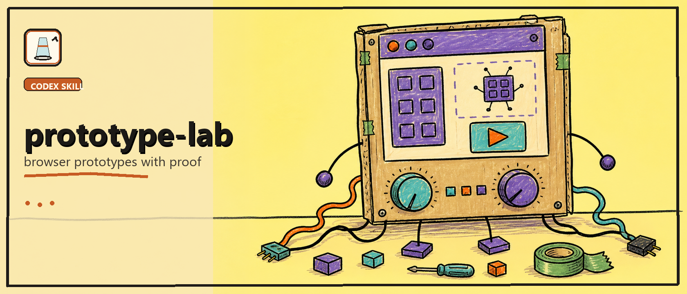

# Prototype Lab



Codex skill and local workspace manager for quickly creating or adopting standalone browser prototypes, iterating them, running honest comparisons, attaching evidence-backed reviews, and packaging portable static artifacts.

The project uses one command surface. The browser hub is generated from artifact metadata; comparison hubs are generated from small editable manifests. Runtime HTML is no longer the place where membership, criteria, and provenance are manually maintained.

## Install

```powershell
npx skills add gvastethecreator/prototype-lab-skill
```

Then invoke `$prototype-lab` or run the workspace manager directly from the installed skill. The default path is intentionally lightweight; capability experiments remain available when rigor matters.

## Choose A Route

| Goal | Command |
| --- | --- |
| Test one idea | `lab quick` |
| Compare options | `lab compare` |
| Benchmark models or skills | `lab experiment` |
| Verify and package | `lab ship` |

## One Workflow

In this repository:

```powershell
npm run lab -- help
npm run lab -- init
npm run lab -- quick --title "Dispatch board" --question "Can an operator resolve an incident without losing queue context?" --profile tool
npm run lab -- open
npm run lab -- preview --id 001 --open
npm run lab -- verify --id 001 --profile full --init-review
npm run lab -- finalize --id 001
npm run lab -- fork --id 001 --title "Dispatch board compact"
npm run lab -- compare --title "Dispatch comparison" --variants 001,002 --dimension design --modes compare,blind,rank,iterations,review
npm run lab -- review --id 003 --init
npm run lab -- review --id 003 --report <completed-review.json>
npm run lab -- experiment --init --id capability-showcase --intent showcase --models gpt-5.5,gpt-5.6-sol --skill ruthless-designer
npm run lab -- experiment --spec experiments/capability-showcase.json
npm run lab -- experiment --spec experiments/natural-benchmark.json --direct-build
npm run lab -- preflight --experiment capability-showcase
npm run lab -- preflight --experiment capability-showcase --review .scratch/prototype-lab/capability-showcase/preflight-review.json
npm run lab -- materialize --experiment capability-showcase
npm run lab -- sync
npm run lab -- status
npm run lab -- doctor
npm run lab -- ship --id 003 --include-proof
```

In another workspace:

```powershell
node <skill-root>/scripts/manage-prototype-lab.mjs <command> --workspace .
```

Use `init --empty` for a blank prompt library. Normal `init` installs the workspace hub and seeds the creative prompt suite.

## What Each Command Owns

| Command | Result |
| --- | --- |
| `init` | Installs `prototypes/index.html`, initializes prompts, and writes index data |
| `quick` | Creates the smallest managed owner for a daily prototype |
| `adopt` | Imports an existing self-contained static build |
| `fork` | Creates an iteration while resetting proof and execution receipts |
| `experiment` | Creates showcase direction packets or direct hashed build packets for `benchmark --direct-build` |
| `preflight` | Validates dispatch isolation, divergence, asset plans, and skill interventions before authorizing builds |
| `materialize` | Creates one final artifact owner and local build packet per authorized variant |
| `create` | Allocates the next chronological id and scaffolds one standalone artifact |
| `compare` / `hub` | Creates a comparison from two or more existing artifacts |
| `record` | Attaches factual model, skill, limitation, and canonical receipt data |
| `verify` | Checks portability; full mode also validates four-viewport browser evidence |
| `finalize` | Marks an artifact complete only after verification passes |
| `review` | Attaches the orchestrator's evidence-backed report to a managed hub |
| `open` | Opens the library or an artifact in the default browser |
| `preview` | Serves the workspace locally when the artifact needs an HTTP origin |
| `sync` | Regenerates managed hubs, prompt catalog, health data, and workspace hub |
| `status` | Reports artifacts, experiments, readiness issues, and exact resume actions |
| `doctor` | Separates installation checks from workspace health |
| `pack` | Produces a portable folder and ZIP under `dist/prototype-lab/` |
| `ship` | Runs full finalization, then packages the ready owner |

Short numeric references such as `001,002` work when unique. `create` and `quick` accept `--from-prompt <library-id>` and profiles `blank`, `tool`, `mobile`, `canvas`, or `data`; `blank` remains visually neutral, while mobile and canvas provide semantic but unstyled runtime roots.

## Capability Comparisons — Advanced

Prototype Lab now separates honest `benchmark` runs from high-freedom
`showcase` runs. A creative showcase does not jump directly into four expensive
builds: isolated workers first return direction fingerprints, asset plans, and
observable skill interventions. The manager rejects overconstrained briefs,
missing required assets, unresolved paired convergence, inherited worker
context, and skill treatments with no visible effect before build authorization.

Prototype Lab remains coordinator-only. Variant workers do not inherit its hub
styling, compact tool-shell preferences, workspace memory, or other variants.
The public isolation contract is capability-first: every variant gets a fresh
worker with no inherited history. Codex records `fork_turns: "none"` only as
evidence for its adapter; a packet-only dedicated CLI can provide the same
boundary through a clean process receipt.
The bundled creative suite uses open decisions and explicit asset/layout policy
instead of prescribing dashboards, panels, controls, or universal no-scroll UI.

## Artifact Model

```text
prototypes/
  index.html                       generated workspace hub
  prototype-index-data.js         generated catalog and health data
  prompts/                         reusable versioned prompts
  <YYYY>/<MM>/<NNN>-prototype/     standalone runtime and evidence owner
  <YYYY>/<MM>/<NNN>-comparison/
    hub.config.json                editable comparison source
    hub-data.js                    generated comparison data
    index.html hub.css hub.js      generated comparison UI
```

Every standalone artifact keeps its runtime, metadata, frozen prompts, run receipts, and proof local. A hub links and compares variants; it does not own or modify their runtime code.

For a managed comparison, edit `hub.config.json` and run `npm run lab -- sync`. Do not maintain variant data inside generated HTML or JavaScript.

## Workspace Hub

Open `prototypes/index.html` directly:

- **Library** browses and searches chronological artifacts.
- **Comparisons** makes hub membership visible and builds exact shareable A/B links.
- **Prompts** exposes reusable prompt versions and challenges.
- **Health** surfaces missing questions, model attribution, proof, or broken comparison links and provides copyable commands.
- **Receipts** turns canonical task records into a readable execution ticket
  with factual model, dispatch, verification, usage, integrity, and limitation details.

The hub is static and portable. It cannot execute commands from the browser; run a copied command through Codex or a terminal and refresh after `lab sync`.

The dashboard follows the full-black product system documented in
[`DESIGN.md`](./DESIGN.md): restrained neutral surfaces, functional accent
colors, pinned Tabler Icons SVGs, and charts generated only from real workspace
metadata. Library, Comparisons, Prompts, Receipts, and Health use distinct information
architectures instead of sharing one generic dashboard layout.

## Portable Packs

```powershell
npm run lab -- pack --id 003
npm run lab -- pack --id 003 --include-proof
```

The pack includes the primary artifact, linked variants, normalized prompts and receipts, a root launcher, a host-neutral `deploy.json`, and a SHA-256 manifest. Proof is omitted by default for smaller uploads. A successful package is a build-free, multi-page static publish directory; packaging rejects root-relative paths, missing local assets, and remote runtime dependencies.

A validated static pack can be adapted to ChatGPT Sites or another static host. Packaging and public publication remain separate permissions.

## Development Validation

```powershell
npm run validate
npm run package:manifest
python <codex-home>/skills/.system/skill-creator/scripts/quick_validate.py SKILLS/prototype-lab
```

The optional browser suites use an external Playwright package so the skill stays dependency-free. Set `PROTOTYPE_LAB_PLAYWRIGHT_ROOT` to that package directory. Set `PROTOTYPE_LAB_CHROMIUM_EXECUTABLE_PATH` as well when using an already installed Chromium-compatible browser instead of a Playwright-downloaded binary.

The test suite exercises prompt versioning, held-out rubrics, overconstrained-brief rejection, direction convergence, dispatch isolation, receipt hashes, required-asset provenance, artifact creation, canonical hub previews, workspace health, packaging, and archive-safe organization.
`package:manifest` verifies the deterministic published-skill digest. Its manifest also records the preserved nested local site repository that is intentionally excluded from this package.

## License

[MIT](./LICENSE)
